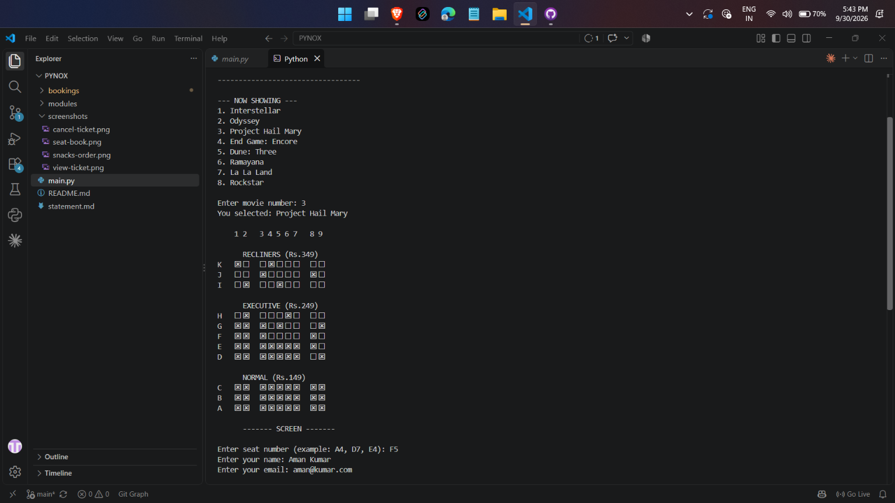
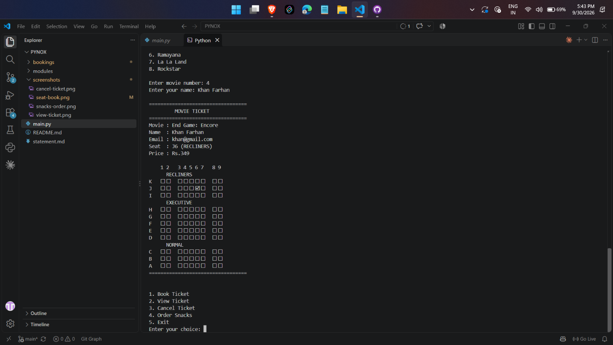
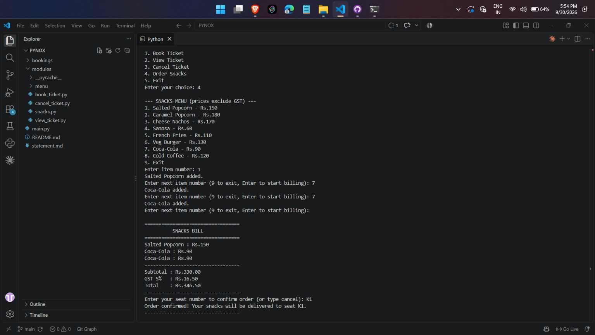
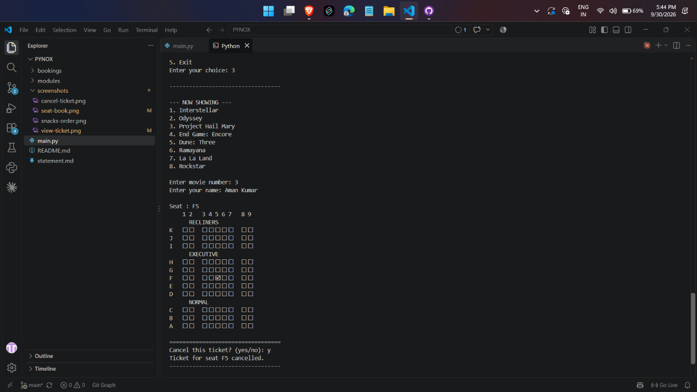

# PYNOX

Pynox movie ticket booking system I made in Python for my Python Essentials course project. It runs in the terminal. You pick a movie, look at the seats, book one and get a ticket. You can also view or cancel your ticket and order snacks to your seat.

## What it can do

- Book a ticket
- Shows the theatre in 3 sections: Recliners (Rs.349), Executive (Rs.249) and Normal (Rs.149). Empty seats are ☐ and booked seats are ☒
- If you pick a seat that is already booked, it tells you and asks for another one
- Checks the name and email you enter
- The ticket has a small seat map with your seat marked 🗹
- View your ticket using the movie and your name
- Cancel a ticket. It finds your seat from your name, shows the seat map and asks you to confirm
- Order snacks from a menu that is read from a text file. You can add as many items as you want, get a bill with 5% GST, and then enter your seat number to confirm the order
- Bookings are saved in the bookings folder, one file for each movie

## Technologies used

- Python 3 (only the built-in os module, nothing to install)
- Text files to store bookings and the snacks menu
- Git and GitHub

## Project structure

```
py-nox/
├── main.py
├── README.md
├── statement.md
├── modules/
│   ├── book_ticket.py
│   ├── view_ticket.py
│   ├── cancel_ticket.py
│   ├── snacks.py
│   └── menu/
│       └── snacks_menu.txt
├── bookings/          (made automatically when you book the first ticket)
└── screenshots/
```

## How to install and run

1. Make sure Python 3 is installed. You can check with:
   ```
   python --version
   ```
2. Download the project:
   ```
   git clone https://github.com/subom7/PYNOX.git
   cd py-nox
   ```
3. Run it from inside the py-nox folder:
   ```
   python main.py
   ```

Only run main.py. The files in the modules folder don't work on their own.

Use a terminal that can show the symbols ☐ ☒ 🗹. The VS Code terminal works fine.

## How to use it

You will see this menu:

```
1. Book Ticket
2. View Ticket
3. Cancel Ticket
4. Order Snacks
5. Exit
```

Type a number and press Enter. When an option finishes, the menu comes back. Seats are typed as the row letter and seat number, like A4, D7 or E4.

## Testing

I tested it by hand. Delete the bookings folder first so every seat is empty, run `python main.py` and try these:

| # | What I tried | What should happen |
|---|--------------|--------------------|
| 1 | Book Ticket, movie 1, seat A4, a name and a proper email | Ticket and seat map are shown and bookings/interstellar.txt is created |
| 2 | Book seat A4 again for movie 1 | It says A4 is already booked and asks for another seat |
| 3 | Open the seat layout for movie 1 again | A4 shows as ☒ |
| 4 | Type Z9 or A0 as the seat | It says the seat is invalid and asks again |
| 5 | Type abc as the email | It says the email is invalid and asks again |
| 6 | View Ticket, movie 1, the same name | Ticket and seat map are shown |
| 7 | View Ticket with a name that never booked | It says no ticket found |
| 8 | Cancel Ticket, movie 1, the name, answer no | Ticket is not cancelled |
| 9 | Cancel Ticket, movie 1, the name, answer yes | Ticket is cancelled and A4 is ☐ again |
| 10 | Order Snacks, add Salted Popcorn, order more, add Samosa, start billing | Subtotal Rs.210.00, GST Rs.10.50, Total Rs.220.50 |
| 11 | Type D7 when it asks for the seat number | It says the order is confirmed for seat D7 |
| 12 | Type exit at the snacks menu, or cancel at the seat number | It says the order is cancelled |
| 13 | Type 9 in the main menu | It says invalid choice and shows the menu again |

## Screenshots

Seat booking:



Ticket:



Snacks bill:



Cancel ticket:

